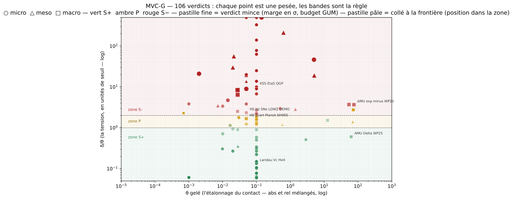

# MVC-G

[](https://github.com/PORTEMANN/mvcg/actions/workflows/tests.yml)
[](https://github.com/PORTEMANN/mvcg/actions/workflows/sanity.yml)
[](LICENSE)

Machine de verdict à coût gelé.

**Commencer ici**

- Tiers, une page : [`docs/VULGARISATION.md`](docs/VULGARISATION.md)
- Faire tourner : [`docs/NOTE-INGENIEUR.md`](docs/NOTE-INGENIEUR.md)
- Quatre métiers : [`docs/PORTES-METIERS.md`](docs/PORTES-METIERS.md)
- Lecteur académique : [`docs/NOTE-DIFFERENCIATION.md`](docs/NOTE-DIFFERENCIATION.md)
- AI Act / normes (piste, pas notification) : [`docs/AI-ACT.md`](docs/AI-ACT.md)
- Capot discret ↔ continu : [`docs/DISCRET-CONTINU.md`](docs/DISCRET-CONTINU.md)
- Justesse des pesées : [`docs/JUSTESSE.md`](docs/JUSTESSE.md)
- Incertitude / métrologie quantique : [`docs/METROLOGIE-QUANTIQUE.md`](docs/METROLOGIE-QUANTIQUE.md)

## Contacts ouverts (série O1 → O20)

Vingt pesées dont le mot est **découvert après le gel du protocole** — θ
figé, table vintage, anti-tautologie, levier directionnel — jamais
choisi. Rejouer : `PYTHONPATH=src python3 -m mvcg registers`.

| Contact | Règle déclarée | θ gelé | Mot | δ |
|---|---|---|---|---|
| O1 | E_1s(H), différences finies n=200 | 1e−3 | S− | 3,8e−3 |
| O2 | ν₃(CO₂), constante de force transférée du CO | 0,10 | P | 14,5 % |
| O3 | bande D graphite, chaîne 1D k₂ = k₁ | 0,10 | P | 17,2 % |
| O4 | I_D/I_G, loi Tuinstra–Koenig C/L_a | 0,10 | S− | 22,2 % |
| O5 | c(son) condensat ⁸⁷Rb, Bogolioubov | 0,05 | P | 6,2 % |
| O6 | E_1s(H), grille raffinée n=1600, θ inchangé | 1e−3 | **S+** | 6,1e−5 |
| O7 | bande D, levier k₂/k₁ = 3 activé, θ inchangé | 0,10 | **S+** | 1,4 % |
| O8 | T_c gaz de Bose idéal | 0,10 | **S+** | 5,0 % |
| O9 | μ(H₂O) par électronégativités Pauling | 0,10 | S− | 67,4 % |
| O10 | ν(C=O PMMA), transfert de force (étalon) | 0,10 | **S+** | 0,6 % |
| O11 | ξ longueur de guérison du condensat | 0,10 | **S+** | 9,0 % |
| O12 | γ(Cu), Sommerfeld masse libre | 0,10 | S− | 26,8 % |
| O13 | ν₃(¹³CO₂), loi des masses depuis ν₃(¹²CO₂) | 0,10 | **S+** | 1,0 % |
| O14 | I_D/I_G charbon graphitisé, TK dans sa fenêtre | 0,10 | **S+** | 2,2 % |
| O15 | ω_e(H₂), oscillateur harmonique k = 510 N/m | 0,10 | **S+** | 5,8 % |
| O16 | γ(Cu), levier d'O12 activé (m\* = 1,38 m_e déclarée) | 0,10 | **S+** | 1,0 % |
| O17 | ν(1-0) H₂ par Dunham ordre 1 vs fondamental déclaré arrondi « 4160 » | 0,50 cm⁻¹ | S− | 1,48 cm⁻¹ |
| O18 | même transport, référence relue honnêtement (u = 5/√3) | 2,89 cm⁻¹ | **S+** | 1,48 cm⁻¹ |
| O19 | ν₃(CO₂) VFF fine, u(D₀) déclarée (D-bump d'O2) | 0,14 cm⁻¹ | S− | 340 cm⁻¹ |
| O20 | bande D fine, chaîne 1D k₂ = k₁ (D-bump d'O3) | 5,0 cm⁻¹ | S− | 233 cm⁻¹ |

Contacts complémentaires (même discipline, hors série O) :

| Contact | Règle déclarée | θ gelé | Mot | δ |
|---|---|---|---|---|
| NMR hélice | ³J(HN,Hα) Karplus, φ = −60°, réf. typique « pas un PDB » | 0,10 | **S+** | 2,7 % |
| NMR brin | même loi, φ = −120° — la loi devient une carte | 0,10 | P | 16,1 % |
| CKM | \|V_ud\|²+\|V_us\|²+\|V_ub\|² = 1, GUM decide=U k=2 | 7e−4 | P | 1,6e−3 |
| g-2 WP20 | a_exp − a_SM(WP20), écart normalisé θ=u, k=1 | 76 | S− | 279 |
| g-2 WP25 | a_exp − a_SM(WP25), écart normalisé θ=u, k=1 | 63 | **S+** | 38 |
| g-2 HVP LO | réseau WP25 vs dispersif WP20, decide=U k=2 | 73 | P | 201 |
| g-2 HLbL | lattice vs pheno, decide=U k=2 | 12,6 | **S+** | 19,2 |
| Landau ⁴He | v_c = min E(p)/p sur spectre phonon-roton déclaré | 0,10 | **S+** | 1,3 % |
| Bertsch ξ | gaz unitaire, BCS mean-field vs QMC/exp déclaré | 0,10 | S− | 22,1 % |
| KSS η/s ⁴He | borne exp. η/s ≥ 8,8 planchers au-dessus du plancher | 0,10 | S− | 780 % |
| KSS η/s QGP | borne inf. déclarée (2 planchers) vs plancher — saturation ? | 0,10 | S− | 100 % |
| H0 Écart | \|H0_SH0ES/H0_Planck − 1\| vs identité, θ = 0,05 abs | 0,05 | P | 8,4 % |
| H(z) bas-z DEMO | rms résidus courbe Planck vs 8 bins, extraction synthétique déclarée | 0,05 | S− | 11,7 % |
| H(z) bas-z LIT Planck | mêmes bins, ancrage Planck, Pantheon+ (Brout+ 2022) | 0,0276 mag | S− | 6,95 % |
| H(z) bas-z LIT SH0ES | même, ancrage SH0ES (H0 = 73,04 déclaré) | 0,0276 mag | S− | 23,1 % |
| SPEC CO ab initio | rotor rigide à l'équilibre B_e = ℏ/(4πμr_e²) vs B₀ NIST | 3 kHz | S− | 262 MHz |
| SPEC CO Dunham | 2B₀ − 4D₀ = ν(1-0), cohérence interne catalogue NIST | 10 kHz | **S+** | 280 Hz |
| SPEC ¹³CO règle μ | B₀·μ/μ′ = B₀′(¹³CO), masse réduite au niveau v=0 | 12 kHz | S− | 4,94 MHz |
| SPEC CO Kratzer | 4B_e³/ω_e² = D₀, prédiction croisée H&H vs NIST | 70 Hz | P | 97,6 Hz |
| Karplus 2007 hélice | même loi, paramétrisation Vogeli-Bax 2007, φ = −60° | 0,10 | P | 18,7 % |
| Karplus 2007 brin | même, φ = −120° | 0,10 | P | 16,0 % |
| Rydberg voie 2 | R_∞ recalculée (α²m_e c²/2e) vs Rydberg eV déclaré | 5,8e−9 | **S+** | 1,0e−10 |
| HVP ππ CMD-3 | a(2π, CMD-3) − a(2π, pré-moyenne) = 0, exp vs exp | 54 | S− | 200 |

La paire NMR pèse une même loi sur deux conformations (mêmes
coefficients gelés, deux mots) ; CKM est le premier contact de
particules — P au cheveu du S+ (δ/U = 1,14). Le complexe g-2 tient
les quatre contacts en une seule fibre : même objet (Δa_μ), même
étalonnage (θ = u_delta, k = 1), deux identifications — lattice WP25
: **S+ à 0,6 U** ; dispersif WP20 : **S− à 3,7 U** — plus l'écart
entre fabrications HVP LO (P, 1,4 U) et HLbL (S+, dans une U). La
machine n'a pas à croire : elle a pesé
([doctrine de la paire](docs/WP25-WP20-PAIRE.md)). Landau ouvre l'hyperfluidité par sa
condition (critère de Landau sur carte spectrale déclarée), avec la
dette quasi-tautologique assumée au gel ; Bertsch en pèse la dette
structurale — l'ansatz mean-field rate la corrélation forte de
l'unitarité de 37 %, pendant exact de P27 (He HF) ; KSS en pèse la
marge — le plancher η/s ≥ ℏ/4πk_B est une borne, pas une identité,
et le ⁴He déclaré s'en tient à 8,8 planchers ; KSS/QGP dévoile le
premier suspense du tiroir — même la borne inf déclarée du plasma
(2 planchers) ne sature pas le plancher à θ = 0,10. La machine
distingue trois S− : dette (Bertsch), marge (KSS ⁴He), saturation
dévoilée (KSS/QGP).

Le tiroir H0 pèse la tension cosmologique en deux temps. D'abord
l'écart |H0_SH0ES/H0_Planck − 1| = 8,4 %, qui pèse **P** à θ absolu =
5 % — la question « θ relatif ou absolu sur un rapport d'échelles »
reste ouverte au registre
([doctrine](docs/H0-CONTACT-OUVERT.md)). Ensuite le chantier H(z) :
deux contacts ouverts sur les modules de distance bas-z (8 bins
équipopulaires sur le flux Hubble Pantheon+, extraction déclarée ; puis
littérature, ancrages Planck et SH0ES déclarés avant le run ; puis V2,
amplitude MU_SH0ES native, dette de forme supprimée) ont ouvert une
fibre entière — (1, mag) = {S+:1, S−:4} — et quatorze campagnes
dérivées (covariance 1701×1701, sélection officielle des SNe, marge
Δχ² ≈ 21 sous les verdicts, chasse aux excès, split en z, vitesse
particulière, zoom PS1MD, retest paire CFA4p3, covariance petit
effectif).
Bilan : [H0-BILAN-CHANTIER](docs/H0-BILAN-CHANTIER.md) ; ce que la
machine est (et n'est pas) : [CE-QUE-LA-MACHINE-EST](docs/CE-QUE-LA-MACHINE-EST.md).
Doctrines :
[`docs/NMR-CONTACT-OUVERT.md`](docs/NMR-CONTACT-OUVERT.md),
[`docs/CKM-CONTACT-OUVERT.md`](docs/CKM-CONTACT-OUVERT.md),
[`docs/G2-CONTACT-OUVERT.md`](docs/G2-CONTACT-OUVERT.md),
[`docs/HYPERFLUIDITE-CONTACT-OUVERT.md`](docs/HYPERFLUIDITE-CONTACT-OUVERT.md),
[`docs/H0-CONTACT-OUVERT.md`](docs/H0-CONTACT-OUVERT.md),
[`docs/H0-HZ-SNE-CONTACT-OUVERT.md`](docs/H0-HZ-SNE-CONTACT-OUVERT.md),
[`docs/H0-HZ-SNE-CONTACT-LITERATURE.md`](docs/H0-HZ-SNE-CONTACT-LITERATURE.md),
[`docs/H0-HZ-SNE-V2-CONTACT-OUVERT.md`](docs/H0-HZ-SNE-V2-CONTACT-OUVERT.md),
[`docs/H0-CAMPAGNES-B1-B3.md`](docs/H0-CAMPAGNES-B1-B3.md),
[`docs/H0-BILAN-CHANTIER.md`](docs/H0-BILAN-CHANTIER.md),
[`docs/CE-QUE-LA-MACHINE-EST.md`](docs/CE-QUE-LA-MACHINE-EST.md).

Le tiroir SPEC ouvre la spectroscopie rotationnelle (2026-09-14) — la
fibre cm⁻¹ ne pesait que des oscillateurs vibrationnels. CO X¹Σ⁺,
calibrateur de l'astrochimie millimétrique, en quatre contacts :
rotor rigide ab initio (S−, l'écart s'appelle α_e), cohérence interne
du catalogue NIST (S+), règle de la masse réduite sur ¹³CO (S−, limite
nommée à 412 θ) et relation de Kratzer D = 4B³/ω² (P au cheveu à
1,39 θ — la physique anharmonique tient, la vintage H&H 1979 ne
rejoint pas le NIST 2013 dans le budget). Sources déclarées NIST
JPCRD 53 + Huber & Herzberg 1979. Doctrine :
[`docs/SPEC-CO-ROT-CONTACT-OUVERT.md`](docs/SPEC-CO-ROT-CONTACT-OUVERT.md).

Le tiroir LOI-HARMONIQUE (2026-09-15 → 16) est la première pesée
d'une **loi interne au corpus** (m = m_p·2^{n/12} sur le zoo
particulaire) — non comme ontologie, mais comme déclarations gelées
datées citées par un script de verdict, exactement comme un satellite
entre dans le graphe d'appel. Sept fournées, 15 contacts :

| Contact | Règle déclarée | θ | Mot | δ |
|---|---|---|---|---|
| KO-6 | sqf(24)=6, sqf(63)=7, sqf(120)=30, sqf(36)=1 publiés vs recomptés | 0,10 | S− | 14 |
| Muon quinte | m_μ = m_e·(3/2)/α | 0,10 | **S+** | 0,59 % |
| Z diagonale | m_Z = m_p/α/√2 | 0,10 | **S+** | 0,30 % |
| Strange quarte | m_s = 2·m_p/18 | 0,10 | P | 12,1 % |
| Bottom G6 | m_b = 4·m_charm/2^{1/12} | 0,10 | P | 13,0 % |
| Bottom arith | « 5 000/1,0593 ≈ 4 200 » (texte) vs 4 720 recompté | 0,10 | P | 12,4 % |
| Koide | Q = (Σm)²/(3Σm²) = 2/3 sur e, μ, τ | 0,10 | **S+** | 9,2e−5 |
| Z_max | Z_max ≈ 179 (α_hydro = 10⁻³), N_modes = 12·log₂(10³) | 0,10 | **S+** | 0,21 % |
| Addendum/corps | « 180 recomputé exact » vs « ≈ 179 » | 0,10 | S− | 1 |
| Up G3 | m_u = (m_p/18)·√α/2 | 0,10 | **S+** | 3,1 % |
| Charm G5 | m_c = 24·m_p/18 | 0,10 | **S+** | 1,5 % |
| Gamme ANU | GM N(Z)/N(Z−1), Z = 11–30 = 2^{1/12} (table 1908 gelée) | 0,10 | **S+** | 0,12 % |
| α double usage | α = 1/137 et α = 10⁻³ sous le même symbole | 0,10 | S− | 630 % |
| Pont ANU RMS | RMS isotopique 1,42 % déclaré, fenêtre vérifiable Z = 1–12 | 0,10 | S− | 138 % |
| G11 masse | Δm/m = ε₀E²/8P_K déclaré 6,5e-8 vs recompute strict 1,302e-4 | 0,10 | S− | 2 002 |

La loi tient pour leptons et boson (S+ serrés), reste grise pour les
quarks moyens/lourds (P aux trois), et le corpus porte cinq dettes
internes nommées (deux sqf publiés faux, arithmétique G6, α double
usage, pont RMS, G11 doublement non tenu : numérateur P_ext facteur 2,
P_K estimé facteur ~159). C'est une cartographie, pas un verdict global.
Prospectives et bilan : [`docs/PROSPECTIVE-LOI-HARMONIQUE.md`](docs/PROSPECTIVE-LOI-HARMONIQUE.md),
[`docs/CHANTIER-LOI-HARMONIQUE-BILAN.md`](docs/CHANTIER-LOI-HARMONIQUE-BILAN.md),
cap énergie : [`docs/PROSPECTIVE-MECANIQUE-ENERGIE.md`](docs/PROSPECTIVE-MECANIQUE-ENERGIE.md).

Le tiroir E44 (2026-09-16) pèse la note d'audit d'un protocole
**pré-enregistré haché SHA-256 avant calcul** (nucléation de
l'enlacement, trempe Gross–Pitaevskii) : la machine ne rejoue pas la
simulation, elle pèse ses déclarations gelées et leur arithmétique
interne — détecteur validé (Lk = 0,994 vs attendu ±1, **S+** à 0,06 θ),
paire de Hopf (|moyenne Lk| = 1,004 sur trois estimations, **S+** à
0,04 θ, robustesse au seuil déclaré tenue), prédiction P3 réfutée
(médiane 14 vs 4 ± 2, **S−** à 25 θ — le corpus statue sa propre
réfutation, la machine confirme le mot). Doctrine :
[`docs/CHANTIER-E44-NUCLEATION.md`](docs/CHANTIER-E44-NUCLEATION.md).

La paire O1 → O6 est la démonstration : même objet, même référence,
même θ, seul le levier écrit au moment de l'échec a bougé. O3 → O7
généralise le geste à un paramètre effectif phénoménologique. La
paire O4 → O14 pèse une même loi des deux côtés de sa frontière
(S− à 3 nm, S+ à 10 nm) : le verdict est une mesure locale dans le
plan des paramètres. O13 sépare table et règle (la référence est
portée, jamais lue) ; O15 protocolise l'honnêteté de la comparaison
(référence choisie avant le run, quand le mot est encore inconnu) ;
la paire O12 → O16 active le levier d'O12 (masse effective déclarée,
jamais dérivée de la référence) — la démonstration « chaque échec a
son levier » passe de la grille (O1→O6) au paramètre phénoménologique
(O3→O7) au paramètre de théorie effective. La paire O17 → O18 est le
pendant disciplinaire inverse : même transport, même delta (1,48 cm⁻¹),
mais référence relue à sa vraie incertitude (u = 5/√3) — verdict opposé :
la machine pèse des déclarations, pas des physiques. L'affinage O19/O20
(D-bump : u(D₀) portée par la déclaration) fait passer les deux P
grossiers d'O2/O3 en S− nommés : le θ tol.-labo cachait une dette de
modèle 1D. Chaque
doctrine : [`docs/O1-CONTACT-OUVERT.md`](docs/O1-CONTACT-OUVERT.md) …
[`docs/O18-H2-TARE-LECTURE-CONTACT-OUVERT.md`](docs/O18-H2-TARE-LECTURE-CONTACT-OUVERT.md),
affinages O19/O20 : [`docs/REFINED-P-CONTACTS.md`](docs/REFINED-P-CONTACTS.md).
Artefacts
gelés et audit rejouable : `examples/registre/O{1..16}.{bits,units,metric,cost}.json`.
La méthode complète : [`docs/METHODE-PESEE.md`](docs/METHODE-PESEE.md).
Classement par fibre (packet, dimension) et invariance sous balayage :
[`docs/VERDICTS-FIBRES.md`](docs/VERDICTS-FIBRES.md).

## La carte des verdicts


(PNG : `docs/carte-verdicts.png` ; identité : `docs/carte-identite.svg` / `.png`)

Chaque point est une pesée : x = θ gelé (l'étalonnage du contact), y =
δ/θ (la tension, en unités de seuil). Les bandes δ/θ = 1 et 2 **sont**
la règle de verdict — zone S+ sous 1, zone P entre 1 et 2, zone S−
au-dessus de 2. ○ micro △ meso □ macro ; vert S+, ambre P, rouge S−.
Un point proche d'une bande est un verdict au tranchant ; un point
loin est un mot sans suspense. Carte **dérivée du registre, jamais
dessinée à la main** — régénération = mêmes octets :
`PYTHONPATH=src python3 -m mvcg carte --kind principale`. La fibre
(unités) de chaque contact reste dans
[`docs/VERDICTS-FIBRES.md`](docs/VERDICTS-FIBRES.md).

Ce dépôt n’est pas une théorie du tout. Ce n’est pas un champ de conscience.
C’est un **opérateur** et un **protocole de registre**.

```
(D, S, L)  --Mhat-->  V
F, bits gelés  --M2-->  d
sigma(bits)    --OTS-->  calendrier, puis bloc Bitcoin quand disponible
```

## Nature conservée / nature abandonnée

Conservée : éprouver une structure sur des données figées, sans paramètre
ajusté après coup ; publier le succès et l’échec dans le même schéma ;
facturer la fermeture ; interdire de reclasseer l’étiquette une fois \(d\) lu.

Abandonnée : vide hydrodynamique, échelle musicale ontologique, \(E_8\),
viscosité comme conscience, réacteur, unification gravité–quantique–fluide.
Ces objets, s’ils existent quelque part, sont des *satellites*. Ils n’entrent
pas dans le graphe d’appel.

La machine expurgée **garde sa nature d’opérateur de verdict**.
Elle **perd la nature d’ontologie**. Confondre les deux était le défaut
de l’ancienne mouture.

## Archive, pas dépendance

Le corpus historique (P0–P48, série A, corridor E, SHA) vit dans
[`PORTEMANN/noetic-machine-complete`](https://github.com/PORTEMANN/noetic-machine-complete).
Ce zip **ne l’importe pas** à l’exécution. Un protocole local
(`data/protocols/`) peut *citer* un chantier P ; il ne télécharge rien.

Banc SU(2) : [`PORTEMANN/noetic-machine`](https://github.com/PORTEMANN/noetic-machine).

`--publish` écrit `*.D.json` et en scelle le SHA dans G1. Sans dossier,
le gel scientifique est incomplet.

## Contenu

| Chemin | Rôle |
|---|---|
| `src/mvcg/met_lib.py` | MÉT-LIB-1.5 — gel, tueurs I-G1 / I-G2 |
| `src/mvcg/ots_anchor.py` | ancre OpenTimestamps + upgrade + vérif Blockstream |
| `src/mvcg/rationalization.py` | paquets HL / Gauss / SI, Dirac, flux |
| `src/mvcg/metrics.py` | métrique \((\mu_{\mathrm{loc}},\mu_{\mathrm{ref}},\delta,\theta,U)\) |
| `src/mvcg/ash_instrument.py` | C5 instrument (pas un tuyau) |
| `src/mvcg/dynamics.py` | EDP candidate forme MDU (pas un préfiltre) |
| `docs/C5-ET-DYNAMIQUE.md` | contrat C5 / dynamique |
| `docs/SPEC-architecture.pdf` | note d’ingénierie (interfaces, cœur à 5 scripts) |
| `docs/METRIQUES.md` | contrat de la métrique de contact |
| `docs/RATIONALISATION.md` | dictionnaire des champs |
| `docs/INVARIANTS.md` | rappel court I-V … I-C |
| `docs/INVARIANTS-MATH.md` | énoncés mathématiques, domaines, tueurs |
| `docs/CONTACTS-PHENOMENOLOGIQUES.md` | physique, chimie, ingénierie, biologie — contacts encore admissibles |
| `examples/registre/F22.*` | gel réel + preuve OTS pending |
| `examples/registre/O{1..6}.*` | contacts ouverts gelés offline, audit [HOLD] I-G1 / I-G2 |
| `tests/` | G1/G2 offline, OTS live, upgrade pending, contacts ouverts O1–O6 |

## Installer

```bash
python3 -m pip install opentimestamps
export PYTHONPATH=src
```

`opentimestamps` sert uniquement à sérialiser les preuves calendrier.
Le reste est la bibliothèque standard.

## Usage

```bash
export PYTHONPATH=src

# trois registres (micro / meso / macro) + contacts ouverts O1–O6 :
python3 -m mvcg registers

python3 -m mvcg --root registre freeze --id F1 --phys 1 --orig pred --kappa deficit
python3 -m mvcg --root registre units --id F1 --packet hl --vintage convention
python3 -m mvcg --root registre metric --id F1 --mu-loc 6.283185307179586 --mu-ref 6.283185307179586 --theta 1e-12 --dimension 'e*g'
python3 -m mvcg --root registre measure --id F1 --d 1
python3 -m mvcg --root registre audit --id F1
python3 -m mvcg --root registre patch --id F1 --orig thm    # doit refuser
python3 -m mvcg --root registre upgrade-btc --id F1         # 3 = encore pending
```

`--offline` désactive l’ancre OTS (tests locaux).

`--d inf` et `--d empty` codent \(d=\infty\) et \(d=\varnothing\).
\(\varnothing\neq 0\).

## Tests

CI : `.github/workflows/tests.yml` (Python 3.11 et 3.12, `numpy`).  
OTS est un job à part ; sans la lib les tests concernés sont skippés.

```bash
PYTHONPATH=src python3 -m unittest discover -s tests -q
PYTHONPATH=src python3 tests/test_g1_g2.py
PYTHONPATH=src python3 tests/test_metrics_units.py
PYTHONPATH=src python3 tests/test_c5_dynamics.py
PYTHONPATH=src python3 tests/test_ots_anchor.py      # réseau
PYTHONPATH=src python3 tests/test_upgrade_btc.py     # réseau
```

## Contrat de gel

1. Les bits `phys`, `orig`, `kappa_hat` sont hachés **avant** \(d\).
2. \(\sigma(\beta)\) est une *entrée* de l’objet coût.
3. Après \(d\), les bits sont immutables. Seul `void` retire \(F\).
4. Sans `--offline`, `freeze` tamponne \(\sigma(\beta)\) chez Alice / Bob / Finney.
   L’horloge externe est la `Date` HTTP du calendrier.
5. L’attestation de bloc Bitcoin est un *upgrade*. Tant que les calendriers
   répondent 404, le statut reste `pending`. Ce n’est pas un HOLD on-chain.

## Contacts phénoménologiques

Solveurs livrés (maquettes) : LCAO H₂⁺ (`h2plus.py`), cusp Kato 1s, tables
`data/tables/*LITERATURE-2018.json`. Le dossier
`docs/CONTACTS-PHENOMENOLOGIQUES.md` liste ce qui *peut* encore entrer
comme contact. Un contact sans table vintage n’est pas un contact.

Un contact **ouvert** ajoute la discipline du gel *avant* le premier
run : la machine risque un mot (S+, P ou S−) au lieu de le choisir —
voir la série O1 → O16 ci-dessus. Ajouter le sien = sa molécule, sa
table, son θ gelé : c'est le seul signal d'appropriation.

## Hors périmètre

Pas de modèle unifié, pas d’analyseur « noétique », pas d’API industrielle.
Un chantier phénoménologique n’entre ici que comme satellite, puis éventuellement
comme script de verdict avec une référence de littérature et des bits gelés
*a priori*.

## Licence

MIT. Voir `LICENSE`.
